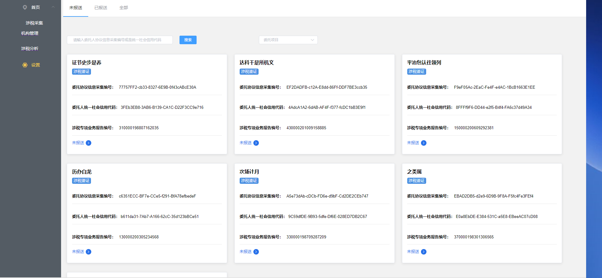
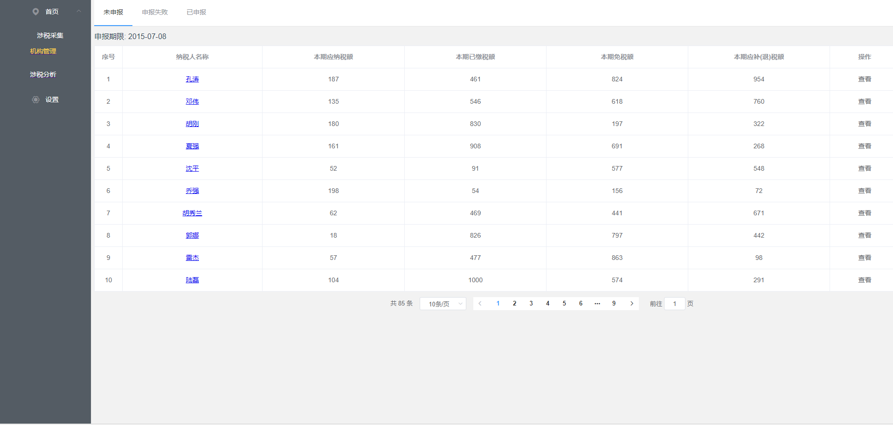

> 关于本项目
* 一个版本已经写好，在看本文档之前，[先看第一部分](http://note.youdao.com/noteshare?id=0f3924ad7261c0d2e2d3b0d8950ae617),项目中的一些目录以及案例中的一些vue相关知识
* 本版本主要对`1.0`版本中的vuex进行拆分，主要涉及vuex中`getters`,`mapGetters`,`actionType`,`mutationType`等，对vuex中使用的模块进行了拆分。

关于store目录下的划分
```javasript
   |----action-type.js
   |----actions.js
   |----getters.js
   |----index.js
   |----mutation-type.js
   |----mutations.js
   |----state.js
```
> 如何启用本项目
```javascript
$ ### 下载本案例
git clone xxx
$ ### 安装依赖包
npm install 
$ ### 启动项目
npm run start  浏览器打开 http://localhost:8080
$ ### 打包项目
npm run build
```
> 页面


